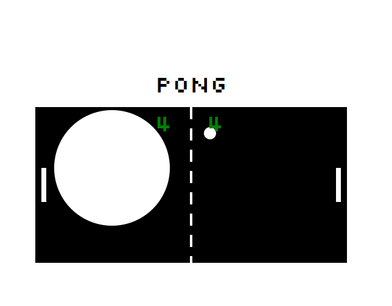

# Pong Game

A basic pong game using SVGs. With a second giant ball in it.

# Screenshot

## Setup

**Install dependencies:**

`> npm i`

**Run locally with Webpack Dev Server:**

`> npm start`

**Build for production:**

`> npm run build`

## Keys

**Player 1:**
* a: up
* z: down

**Player 2:**
* ▲ : up
* ▼: down

## Technologies Used

* JavaScript
* Html 5
* CSS
* SCSS
* Webpack
